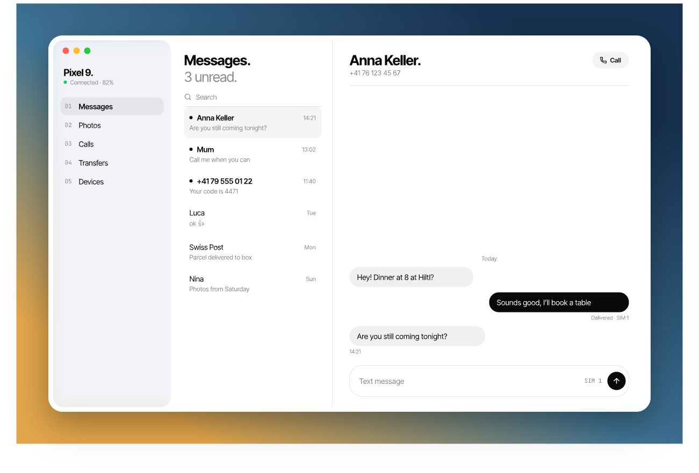
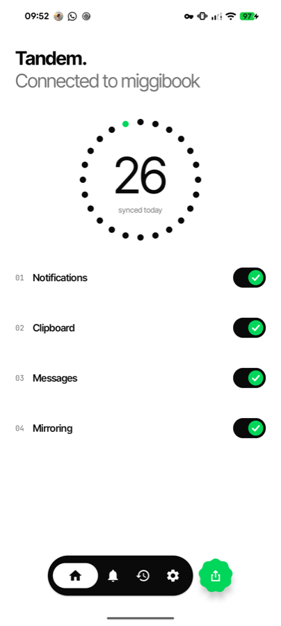
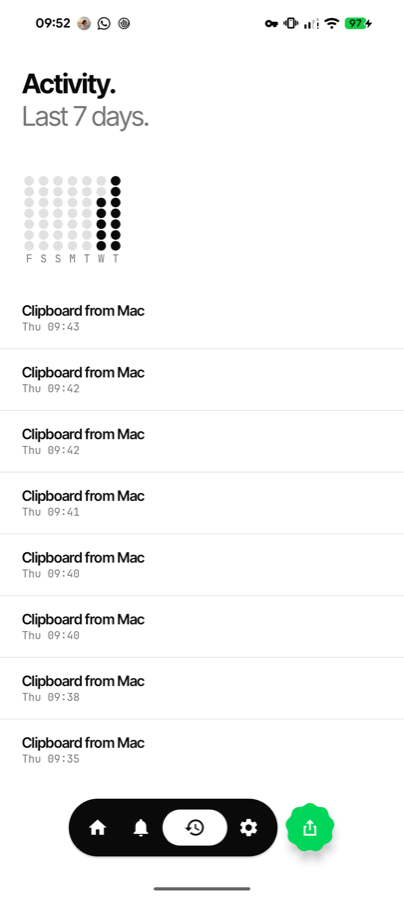
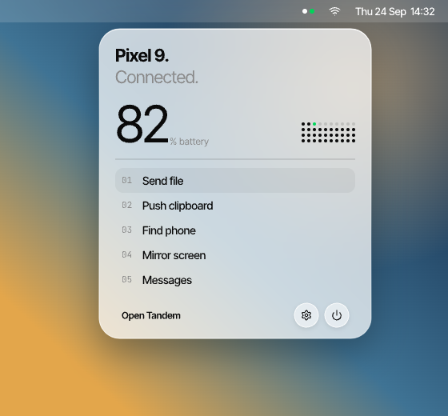

# Tandem

[](LICENSE)


An open-source companion between an Android phone and a Mac. Notifications, clipboard, files,
photos, SMS, calls and screen mirroring move over a direct, mutually authenticated TLS 1.3
connection, with keys pinned once by scanning a QR code. No cloud, no account, no plaintext
fallback.

<p>
  
  
  
</p>

## Features

- **Notifications** from the phone on the Mac, with per-app filtering.
- **Clipboard** both ways. Mac to phone is automatic; phone to Mac is one tap, or automatic with
  the opt-in clipboard service. A small toast confirms each copy on the Mac.
- **Files and photos** in both directions, with accept prompts, resumable transfers and a
  chosen download folder.
- **Messages and calls**: read and send SMS, search contacts and place calls from the Mac.
- **Screen mirroring** with remote input, only during a session you start on the phone.
- **Find phone** from the Mac menu bar.



## Security

- All traffic is mTLS 1.3 between two pinned keys. Trust is bound to SPKI fingerprints exchanged
  by QR pairing, never to IP addresses or device names.
- No plaintext listener, no HTTP server, no fallback mode. A pin mismatch fails closed with a
  visible error.
- The Android app opens no listening sockets. Remote input is accepted only during a
  user-started mirror session with an on-phone indicator.
- Release logs never contain secrets, message bodies, notification text or clipboard content.

Details: [protocol spec](docs/protocol/SPEC.md) and the security invariants in the
[PRD](docs/PRD.md).

## Build

Requirements: an Android 13+ phone, macOS 15+ with Xcode 26, and JDK 17. Both devices must
reach each other on the same network or over a VPN such as Tailscale.

```sh
# Android
(cd android && ./gradlew :app:assembleDebug test detekt ktlintCheck)

# macOS (unsigned local build) and package tests
xcodebuild -project macos/Tandem.xcodeproj -scheme Tandem -destination 'platform=macOS' \
  build CODE_SIGNING_ALLOWED=NO
macos/test-packages.sh
```

Open Tandem on the Mac, choose **Pair phone**, and scan the QR code with the Android app.

## Repository

```
android/   Kotlin and Compose app, core/* and feature/* modules
macos/     Swift 6 menu bar app and local SwiftPM packages
protocol/  .proto schema (single source of truth) and cross-platform test vectors
docs/      PRD, protocol spec, design spec, ADRs, planning
tools/     conformance, pcap-audit, mitm-lab, fuzzing, lint and planning scripts
```

Changes are test-driven; [CLAUDE.md](CLAUDE.md) lists the checks every change must pass and the
[roadmap](docs/planning/roadmap.md) tracks open work.

## License

[Apache License 2.0](LICENSE). The bundled fonts (Inter Tight, JetBrains Mono) are under the SIL
Open Font License; see [docs/dependencies.md](docs/dependencies.md).
