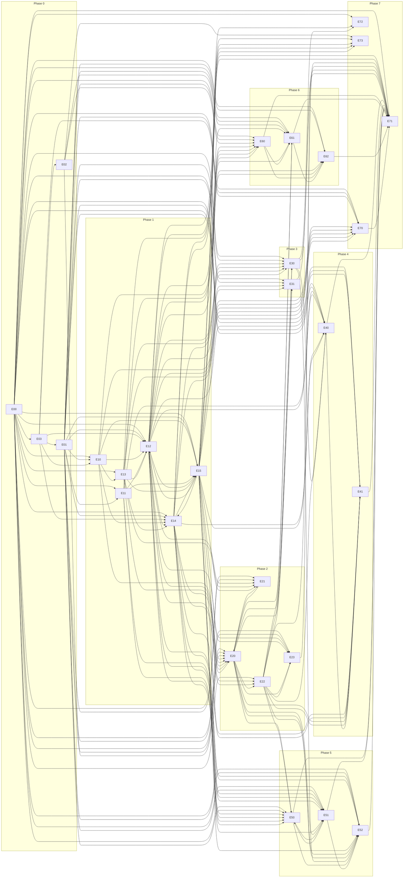

# Tandem — roadmap

Phases map to GitHub milestones. A phase starts only when the previous phase's exit
checklist passes in CI (plus manual device gates where noted). Epics inside a phase run in
parallel where the graph allows. An issue can stay in an early epic but land at the start of a
later phase (`lands_in_phase`, see `backlog/SCHEMA.md`); it then counts toward that phase's
milestone and exit, and no earlier-phase issue may depend on it (validator-checked).

Planning decisions that refine or override PRD text are logged in [`decisions.md`](decisions.md);
decisions still waiting for the owner are in [`open-questions.md`](open-questions.md).

## Start here — first TDD sprint

Ordered by slack on the Phase 0 → Phase 1 critical path (see below). Items on the same row
number can start the same day. **A** = Android track, **M** = macOS track, **S** = shared
(docs, protocol, tools, ci); A and M never block each other inside a row.

| # | Track | Issue | Why now |
|---|---|---|---|
| 1 | S | E00-01 [docs] Create monorepo directory skeleton | Zero slack; unblocks every build issue. |
| 1 | S | E00-23 [docs] Physical device matrix and manual-gate procedure | Zero slack: gates the Keystore spike E03-03, which gates the channel-binding outcome. |
| 1 | M | E03-01 [macos] Spike: NWListener mTLS, verify block, exporter | 0.5 d slack; answers the Network.framework half of channel binding. |
| 2 | A | E03-03 [android] Spike: SSLSocket client auth via AndroidKeyStore | On the Phase 0 path (E00-23 → E03-03 → E03-04 → E01-01). |
| 2 | S | E01-03, E01-05 [docs] SPEC framing + envelope, errors + close codes | Unblock envelope.proto (E01-10) and the vector format (E01-16). |
| 2 | S | E02-01 [docs] STRIDE threat model per data flow | L doc with 1.5 d slack; start early so E02-08 is not last. |
| 3 | A | E00-02 → E00-04 → E00-05 [android] Gradle skeleton, JUnit5 + Turbine, ktlint/detekt | Android build + test baseline; first red/green test in the repo. |
| 3 | M | E00-07 → E00-08 [macos] Xcode + SwiftPM skeleton, Swift Testing + SwiftLint | macOS build + test baseline, in parallel with row 3 A. |
| 4 | S | E00-09 → E00-11 [protocol/ci] buf codegen, path-filtered workflows | CI green on empty modules (Phase 0 exit); gates the emulator job. |
| 4 | S | E01-16 [tools] Vector file format + Python reference generator | First pytest red/green; only needs close-code names now. |
| 5 | A | E00-18 → E00-19, E00-20 [android] Clock/TestClock, duplex pipe, Robolectric + Compose | Seams every Phase 1 Android test injects. |
| 5 | M | E00-24 → E00-25 [macos] ManualTestClock, InMemoryConnectionPair | Seams every Phase 1 macOS test injects. |
| 6 | S | E03-04 [cross] End-to-end handshake spike → `docs/spikes/channel-binding.md` | Session-binding outcome issue: E01-01/02/11, E14-06/07, E70-01 wait on it. |
| 6 | S | E00-21 [ci] Android emulator job (Gradle Managed Devices) | Needed by E10-01 / E10-02 / E12-06 on Phase 1 day one. |
| 7 | S | E01-01, E01-02 → E01-17, E01-18, E01-21 [docs/tools] Handshake + pairing SPEC, vectors | Close Phase 0; vectors feed E10-03 / E10-08 / E10-12 / E10-13. |

Phase 1 day one (all unblocked when Phase 0 exits; zero or low slack first):
**M** E10-16 KeychainStore seam (zero slack, heads the Phase 1 critical path) → E10-05 → E10-06 → E10-07;
**A** E10-15 IdentityKeyStore seam → E11-01 frame encode → E13-01 trust-store spike;
**M** E11-03 frame encode, E11-14 credit ledger; **A** E11-13 credit ledger, E10-10 constant-time compare;
**S** E00-30 release test-code scan (lands Phase 1, gates the harness driver E15-22), E15-18 audit runner,
E15-04 pcap-audit harness and E15-08 mitm-lab scaffold (no dependencies).

## Epic dependency graph

Generated from issue-level `depends_on` (an edge A --> B means some issue in B depends on an issue
in A). Epics sit in their own phase; E00 items that land later (`lands_in_phase`) keep their E00 edges.

<!-- BEGIN GENERATED: epic-graph -->

<!-- END GENERATED: epic-graph -->

Notes: E15 is not purely downstream of E12. The JVM harness (E15-15, joining E15-21 / E15-22) is
built on E12's listener and client and then blocks the E12-13 and E14-16 scenario tests, so E12 and
E15 (and E14 and E15) interleave at issue level; there is no issue-level cycle (validator-checked).
E20 and E21 likewise interleave (E21-05 feeds E20-06, which E21-06 tests).

## Critical path

<!-- BEGIN GENERATED: critical-path -->
Generated by `ruby tools/planning/critical_path.rb --write` (S = 0.5, M = 1.5, L = 4 days,
unlimited parallelism; earlier-phase work counts as done). **Exit path** = longest chain of P0
issues (gates the phase checklist); **all** includes P1/P2.

| Phase | P0 issues | Exit path | All issues | Sum of P0 effort |
|---|---|---|---|---|
| 0 | 60 | 7.0 d | 7.0 d | 60.5 d |
| 1 | 108 | 15.5 d | 16.5 d | 118.5 d |
| 2 | 35 | 7.5 d | 9.0 d | 39.0 d |
| 3 | 28 | 8.0 d | 8.0 d | 26.0 d |
| 4 | 24 | 14.5 d | 14.5 d | 46.5 d |
| 5 | 30 | 12.0 d | 12.0 d | 42.0 d |
| 6 | 33 | 12.0 d | 16.0 d | 44.0 d |
| 7 | 27 | 6.0 d | 8.5 d | 35.5 d |

Phase-gated total (sum of exit paths): **82.5 d**. Ungated longest P0 chain across all
phases: 27.5 d (E00-01 → … → E40-14).

#### Phase 0 exit path — 7.0 d

| ID | Size | Title |
|---|---|---|
| E00-01 | S | [docs] Create monorepo directory skeleton per PRD structural decomposition |
| E00-02 | M | [android] Gradle multi-module skeleton, convention plugins, version catalog |
| E00-09 | M | [protocol] buf setup + codegen for protobuf-kotlin-lite and swift-protobuf |
| E00-11 | M | [ci] GitHub Actions workflows with path filters (android/macos/protocol/conformance) |
| E00-21 | M | [ci] Android emulator instrumented-test job (Gradle Managed Devices) |
| E00-03 | S | [android] Hilt DI wiring skeleton across modules |

#### Phase 1 exit path — 15.5 d

| ID | Size | Title |
|---|---|---|
| E10-16 | M | [macos] KeychainStore seam + in-memory test implementation |
| E10-05 | M | [macos] CryptoKit/Security P-256 key generation in Keychain |
| E10-06 | S | [macos] Self-signed certificate via swift-certificates |
| E10-07 | S | [macos] SecIdentity construction for Network.framework |
| E12-01 | M | [macos] NWListener: TLS 1.3-only mTLS options, single port |
| E12-02 | M | [macos] Verify block: trust store check or open pairing window |
| E12-09 | M | [macos] Connection state machine |
| E12-12 | M | [macos] Transport session abstraction exposing channels |
| E14-08 | M | [macos] Pairing confirmation dialog and PairAccepted/reject |
| E14-16 | L | [cross] End-to-end: QR pair then reconnect after restarting both apps |

#### Phase 2 exit path — 7.5 d

| ID | Size | Title |
|---|---|---|
| E21-04 | M | [android] NsdManager browse and resolve |
| E21-05 | M | [android] Recognize paired Macs from rotating id |
| E20-06 | M | [android] Reconnect address strategy and exponential backoff |
| E20-07 | S | [android] Reconnect on ConnectivityManager network callback |
| E23-02 | M | [android] Battery/network/signal observers |
| E23-03 | S | [android] Publish-on-change with 60 s throttle |
| E23-08 | S | [cross] Status throttle and ring round-trip tests |

#### Phase 3 exit path — 8.0 d

| ID | Size | Title |
|---|---|---|
| E30-01 | M | [protocol] notify.proto: posted/action/dismiss/icon messages |
| E30-02 | M | [android] NotificationListenerService capture and mapping |
| E30-03 | S | [android] Default notification filter |
| E30-04 | M | [android] Per-app allow/deny settings |
| E30-11 | M | [android] VISIBILITY_SECRET content handling (phone-side opt-in) |
| E30-13 | M | [cross] Phase 3 notification exit test |

#### Phase 4 exit path — 14.5 d

| ID | Size | Title |
|---|---|---|
| E40-01 | M | [protocol] files.proto: offer/accept/chunk/complete/cancel/resume |
| E40-02 | S | [protocol] Filename sanitization rule and shared vectors |
| E40-16 | S | [android] FilenameSanitizer |
| E40-05 | L | [android] Receiver: temp file, verify, atomic move to MediaStore |
| E40-08 | L | [android] Resume by offset after disconnect |
| E40-14 | L | [tools] 4 GB transfer with forced disconnect |

#### Phase 5 exit path — 12.0 d

| ID | Size | Title |
|---|---|---|
| E50-01 | M | [protocol] sms.proto: threads, messages, sync cursors, send, SIM list |
| E50-09 | L | [macos] Local SMS store: GRDB SQLite persistence + at-rest decision |
| E51-04 | M | [macos] Contacts cache (GRDB) + lookup API + sync client |
| E50-07 | M | [macos] Conversation thread list UI |
| E50-08 | M | [macos] Message view + compose |
| E52-07 | S | [macos] Place call UI |
| E52-08 | M | [cross] Device-level test: call control latency and correctness |

#### Phase 6 exit path — 12.0 d

| ID | Size | Title |
|---|---|---|
| E60-01 | M | [protocol] media.proto: ticket issuance + MediaHello binding |
| E60-08 | M | [macos] MediaTicket issuer + validator (30 s expiry, single use, session binding) |
| E60-03 | M | [macos] Media connection acceptor on the single listener |
| E60-02 | M | [android] Media ticket request + second mTLS connection dial |
| E61-03 | M | [android] VirtualDisplay + MediaCodec encode pipeline to MediaFrame |
| E61-08 | L | [cross] Mirroring performance harness: fps + end-to-end latency |
| E61-09 | S | [tools] pcap-audit with on-screen canary during mirroring |

#### Phase 7 exit path — 6.0 d

| ID | Size | Title |
|---|---|---|
| E70-01 | M | [protocol] rotation.proto: RotationChallenge, KeyRotation, RotationAck, RotationReject |
| E70-02 | M | [android] Initiate rotation: generate new key + sign with old key |
| E70-08 | M | [android] Rotation failure and rollback handling |
| E70-10 | M | [cross] End-to-end rotation: JVM client and real Mac server (E15-15) |
<!-- END GENERATED: critical-path -->

Cycle 5 changes (days; "P0" = exit path over P0 issues, "all" includes P1/P2):

| Phase | 0 | 1 | 2 | 3 | 4 | 5 | 6 | 7 | Sum |
|---|---|---|---|---|---|---|---|---|---|
| Before, P0 | 8.0 | 21.5 | 8.5 | 8.0 | 14.5 | 11.5 | 12.0 | 6.0 | 90.0 |
| Before, all | 8.0 | 21.5 | 9.0 | 8.0 | 14.5 | 12.0 | 16.0 | 8.5 | 97.5 |
| After, P0 | 7.0 | 15.5 | 7.5 | 8.0 | 14.5 | 12.0 | 12.0 | 6.0 | 82.5 |
| After, all | 7.0 | 15.5 | 7.5 | 8.0 | 14.5 | 12.0 | 16.0 | 8.5 | 89.0 |

Phase 5 P0 rises 11.5 → 12.0 only because E52-07 (place-call UI, already required by P0 E52-08)
became P0; the "before, P0" figures understate reality wherever P0 work waited on a P1 issue.
How:

- **Phase 0:** companion app E00-22 lands in Phase 3 (was the Phase 0 tail); vector format E01-16 no
  longer waits on all SPEC sections (each vector issue depends on its own section); E00-23 no longer
  waits on the skeleton. The channel-binding gate (E03-04 → E01-01/E01-02) was added and still fits
  inside 7.0 d.
- **Phase 1:** E15-15 (L) split into E15-21 (Android JVM client) and E15-22 (Mac app driver), built in
  parallel with the Mac identity chain and joined by an M; E14-16 opens the pairing window through
  the E15-22 Debug hook instead of the pairing UI (E14-11) and no longer waits on the E12-13 test;
  E14-18 and E15-07 depend on the pairing implementation instead of the E14-16 test; E15-18 runner
  has no tool dependencies (steps discovered by convention) and the all-tools fan-in moved to the S
  gate E15-23; E12-01 consumes an `IdentityState` protocol instead of waiting for E10-09.
- **Phase 2:** E20-06 / E20-09 consume E12-08 connection states, not the E20-15 heartbeat detector,
  so E20-15 (L) is off the critical path and was not split.
- **Phase 4 candidate (not done):** the three L issues E40-05 → E40-08 → E40-14 form the path; split
  the Android receiver (temp-file verify vs. MediaStore publish) when Phase 4 is refined.

### Hotspots

<!-- BEGIN GENERATED: hotspots -->
| Fan-out (most dependents) | n | Fan-in (most dependencies) | n |
|---|---|---|---|
| E00-20 [android] Robolectric + Compose UI test setup on the JVM | 45 | E71-13 [tools] Fuzz targets: per-domain message decoders, macOS libFuzzer (24 h each) | 14 |
| E00-21 [ci] Android emulator instrumented-test job (Gradle Managed Devices) | 40 | E15-23 [tools] Phase 1 security audit gate: every Phase 1 step green in one report | 13 |
| E00-23 [docs] Physical device matrix and manual-gate procedure | 40 | E71-04 [tools] Fuzz targets: per-domain message decoders, Android Jazzer (24 h each) | 13 |
| E12-11 [android] Transport session abstraction exposing channels | 37 | E71-12 [docs] Release security audit checklist and sign-off | 12 |
| E12-12 [macos] Transport session abstraction exposing channels | 36 | E14-18 [android] Keystore client-auth device matrix test (StrongBox, TEE-only, API 29, OEM) | 11 |
| E00-24 [macos] TandemTestSupport package: injectable Clock and ManualTestClock | 34 | E30-13 [cross] Phase 3 notification exit test | 9 |
| E00-08 [macos] Swift Testing baseline + SwiftLint configuration | 31 | E31-10 [cross] Clipboard exit test: no echo loop, concealed never leaves Mac | 9 |
| E00-18 [android] core/testing fixtures: injectable Clock, TestClock, dispatcher rules | 30 | E41-01 [protocol] photos.proto: PhotoPage and Thumb messages | 9 |
| E15-15 [cross] JVM integration-test harness: JVM client against the real Mac server on macOS CI | 29 | E15-09 [tools] mitm-lab: pairing-abuse scenarios (replay, expiry, 4th attempt, wrong key) | 8 |
| E00-04 [android] JUnit5 + Turbine test infrastructure baseline | 21 | E20-12 [tools] Reconnect latency measurement harness and overnight Doze gate | 8 |
<!-- END GENERATED: hotspots -->

Fan-out hotspots are test seams and session abstractions; they are all Phase 0 / early Phase 1
and have no remaining dependencies to trim. The largest fan-in items are release/phase gates by
design (E71-04, E71-13, E71-12, E15-23); keep them S/M.

### P0 effort per track

Sum of P0 effort per phase; A and M can proceed in parallel, shared work is spread across both.

<!-- BEGIN GENERATED: tracks -->
| Phase | android | macos | shared (protocol, docs, tools, ci, cross) |
|---|---|---|---|
| 0 | 11.0 d | 8.0 d | 41.5 d |
| 1 | 43.0 d | 49.5 d | 26.0 d |
| 2 | 23.0 d | 12.5 d | 3.5 d |
| 3 | 11.0 d | 6.5 d | 8.5 d |
| 4 | 19.5 d | 19.0 d | 8.0 d |
| 5 | 19.0 d | 12.0 d | 11.0 d |
| 6 | 16.5 d | 11.0 d | 16.5 d |
| 7 | 6.5 d | 6.5 d | 22.5 d |
<!-- END GENERATED: tracks -->

## Phase checklists

### Phase 0 — Foundations
**Entry:** empty repo.
- [ ] Monorepo scaffolded; CI green on empty modules for Android, macOS, protocol (E00)
- [ ] `CLAUDE.md` with security invariants and commands (E00)
- [ ] Test seams, emulator CI, device matrix and manual gates ready (E00-18…E00-25, E00-21, E00-23)
- [ ] `SPEC.md` v1 complete: handshake, pairing, framing, channels, errors, versioning, timeouts/limits/caps, untrusted strings (E01)
- [ ] `.proto` for envelope, pairing, control, status; `buf lint` passes (E01)
- [ ] Test vectors: fingerprint, pairing HMAC + code, frames valid/invalid, Bonjour ID, QR payload, display strings (E01)
- [ ] Threat model (STRIDE per data flow + local surfaces, E02-08) and ADR-001 … ADR-006 accepted (E02)
- [ ] Spikes answered: Network.framework mTLS, Secure Enclave identity, Android Keystore client auth, hello-world handshake (E03)
- [ ] Channel-binding outcome recorded (in-band challenge, unconditional per D-67) and adopted by SPEC (E03-04)

### Phase 1 — Identity, pairing, secure transport
**Entry:** Phase 0 checklist complete. **Lands at start:** E00-26 XCUITest, E00-29 supply chain, E00-30 release test-code scan.
- [ ] Phone pairs with Mac via QR and reconnects after restarting both apps (UC-03)
- [ ] Phone commits trust only after "Codes match"; Mac defaults to Don't Pair (AC-20)
- [ ] `pcap-audit`: only TLS 1.3 on the Tandem port, no canary strings (AC-02)
- [ ] All `mitm-lab` scenarios fail closed: unknown client cert, wrong server cert, replayed `PairRequest`, expired secret, 4th attempt, proof for different phone key (AC-01, AC-03, AC-04)
- [ ] Pre-auth DoS scenarios fail closed and paired peers stay unaffected (AC-13; E15-20, E12-18)
- [ ] `nmap` against phone: no Tandem listening ports
- [ ] Conformance vectors green on both platforms in CI
- [ ] Fuzz smoke runs in CI (frame + envelope parsers)
- [ ] Keystore client-auth device matrix passes on physical devices (PRD risk; E14-18)
- [ ] QR decoder chosen with zero observed egress (E14-23)
- [ ] Supply-chain checks and release test-code scan required in CI (E00-29, E00-30)
- [ ] Security audit runner gives one report with every Phase 1 step; automatable subset required on `core/*` PRs (UC-25; E15-23, E15-19)

### Phase 2 — Lifecycle and reliability
**Lands at start:** E00-28 Android platform-hardening baseline.
- [ ] Survives Mac sleep/wake, Wi-Fi switch, phone Doze overnight (UC-04)
- [ ] Reconnect < 5 s p95 (measured harness)
- [ ] Foreground service restarts after process death and after reboot (E20-02, E20-08)
- [ ] Bonjour rotating ID recognized by paired phone only (AC-05)
- [ ] Menu bar shows state, battery, errors; launch at login (UC-05)
- [ ] Find my phone rings through DND (UC-06)
- [ ] Android hardening check required in CI (E00-28)

### Phase 3 — Notifications and clipboard
**Lands at start:** E00-22 companion test app.
- [ ] Reply to a WhatsApp and a Signal notification from the Mac (UC-09)
- [ ] Dismiss sync both ways (UC-10)
- [ ] Notification p95 latency < 500 ms (UC-08)
- [ ] No clipboard echo loops; concealed pasteboard items never leave the Mac (UC-12)

### Phase 4 — Files and photos
- [ ] 4 GB both ways with forced disconnect midway; SHA-256 matches (UC-16)
- [ ] Transfer does not delay notifications (flow-control test)
- [ ] Photo browser pages a 10k library with bounded cache (UC-17)

### Phase 5 — Messaging, contacts, calls
- [ ] Send and receive SMS from the Mac (UC-18, UC-19)
- [ ] Incoming call shows on the Mac within 1 s; answer and hang up work (UC-20)
- [ ] Place a call from the Mac, incl. SIM choice and the background-start fallback (UC-21)

### Phase 6 — Mirroring and remote input
- [ ] ADR-006 decided
- [ ] 1080p ≥ 30 fps, < 120 ms e2e latency (UC-22)
- [ ] `pcap-audit` passes during mirroring with canary on screen
- [ ] Media connection without / with reused ticket rejected (AC-08)
- [ ] Input rejected when no user-started session exists (AC-06)

### Phase 7 — Extras and hardening
- [ ] Key rotation, incl. two-phase Mac rotation with two paired phones (UC-24, decision D-34)
- [ ] 24 h fuzz campaigns per target, no crashes (AC-07)
- [ ] External review of `SPEC.md`
- [ ] Network egress audit: apps talk only to each other (AC-18; E71-14)
- [ ] SBOM / license scan clean (E71-10)
- [ ] Release security audit checklist signed off, one row per `decisions.md` entry (UC-25)
- [ ] F-10.x items as prioritized; F-2.2 ADR if still wanted (optional)

Requirement-to-issue coverage lives in [`traceability.md`](traceability.md);
`ruby tools/planning/critical_path.rb --check` fails if any row of its section (b) has no P0 issue.
