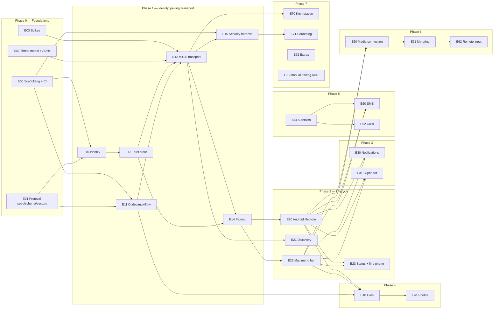

# Tandem — roadmap

Phases map to GitHub milestones. A phase starts only when the previous phase's exit
checklist passes in CI (plus manual device gates where noted). Epics inside a phase run in
parallel where the graph allows.

## Epic dependency graph

## Phase checklists

### Phase 0 — Foundations
**Entry:** empty repo.
- [ ] Monorepo scaffolded; CI green on empty modules for Android, macOS, protocol (E00)
- [ ] `CLAUDE.md` with security invariants and commands (E00)
- [ ] `SPEC.md` v1 complete: handshake, pairing, framing, channels, errors, versioning (E01)
- [ ] `.proto` for envelope, pairing, control, status; `buf lint` passes (E01)
- [ ] Test vectors: fingerprint, pairing HMAC, frames valid/invalid, Bonjour ID, QR payload (E01)
- [ ] Threat model (STRIDE per data flow) and ADR-001 … ADR-006 accepted (E02)
- [ ] Spikes answered: Network.framework mTLS, Secure Enclave identity, Android Keystore client auth, hello-world handshake (E03)

### Phase 1 — Identity, pairing, secure transport
**Entry:** Phase 0 checklist complete.
- [ ] Phone pairs with Mac via QR and reconnects after restarting both apps (UC-03)
- [ ] `pcap-audit`: only TLS 1.3 on the Tandem port, no canary strings (AC-02)
- [ ] All `mitm-lab` scenarios fail closed: unknown client cert, wrong server cert, replayed `PairRequest`, expired secret, 4th attempt, proof for different phone key (AC-01, AC-03, AC-04)
- [ ] `nmap` against phone: no Tandem listening ports
- [ ] Conformance vectors green on both platforms in CI
- [ ] Fuzz smoke runs in CI (frame + envelope parsers)

### Phase 2 — Lifecycle and reliability
- [ ] Survives Mac sleep/wake, Wi-Fi switch, phone Doze overnight (UC-04)
- [ ] Reconnect < 5 s p95 (measured harness)
- [ ] Bonjour rotating ID recognized by paired phone only (AC-05)
- [ ] Menu bar shows state, battery, errors; launch at login (UC-05)
- [ ] Find my phone rings through DND (UC-06)

### Phase 3 — Notifications and clipboard
- [ ] Reply to a WhatsApp and a Signal notification from the Mac (UC-09)
- [ ] Dismiss sync both ways (UC-10)
- [ ] Notification p95 latency < 500 ms (UC-08)
- [ ] No clipboard echo loops; concealed pasteboard items never leave the Mac (UC-12)

### Phase 4 — Files and photos
- [ ] 4 GB both ways with forced disconnect midway; SHA-256 matches (UC-16)
- [ ] Transfer does not delay notifications (flow-control test)
- [ ] Photo browser pages a 10k library with bounded cache (UC-17)

### Phase 5 — Messaging, contacts, calls
- [ ] Send and receive SMS from the Mac (UC-18, UC-19)
- [ ] Incoming call shows on the Mac within 1 s; answer and hang up work (UC-20)

### Phase 6 — Mirroring and remote input
- [ ] ADR-006 decided
- [ ] 1080p ≥ 30 fps, < 120 ms e2e latency (UC-22)
- [ ] `pcap-audit` passes during mirroring with canary on screen
- [ ] Media connection without / with reused ticket rejected (AC-08)
- [ ] Input rejected when no user-started session exists (AC-06)

### Phase 7 — Extras and hardening
- [ ] Key rotation (UC-24)
- [ ] 24 h fuzz campaigns per target, no crashes (AC-07)
- [ ] External review of `SPEC.md`
- [ ] Release security audit checklist signed off (UC-25)
- [ ] F-10.x items as prioritized; F-2.2 ADR if still wanted

## Where to start (TDD)

Phase 0 is mostly documents and scaffolding; the first red/green cycles begin with the
test vectors (E01) and the codec + fingerprint work in Phase 1 (E10, E11), which only need
the vectors. The transport epics (E12) wait on the E03 spikes.
