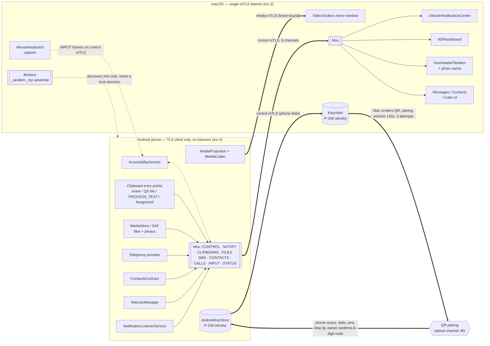

# Tandem — threat model

STRIDE analysis of every network/protocol data flow in the architecture, per backlog issue
**E02-01**. This is chapter 1 of the threat model. Chapter 2 — Android IPC, Mac local surfaces,
storage, logs/crash reports, and CI/supply chain — is backlog issue **E02-08** (depends on this
issue) and will be appended below the marker at the end of this file.

Conventions used throughout:
- **Inv N** = security invariant N from `CLAUDE.md` / PRD `<architecture>`.
- **D-NN** = a row in [`decisions.md`](planning/decisions.md). D-60, D-61, and D-62 are cited
  ahead of that file: D-60 (phone answers at most one Heartbeat per second, extras dropped
  silently), D-61 (CONTROL-channel non-Heartbeat frames capped at 60/s per session,
  `LIMIT_EXCEEDED` beyond that), and D-62 (`Ring` is idempotent while already ringing; the alarm
  starts at most twice per rolling 10 s window) are pending addition to `decisions.md` by another
  branch at the time of writing.
- **E##-##** = an owning backlog issue in `docs/planning/backlog/*.yaml` (implements the
  mitigation or the verifying test).
- **AC-##** = an abuse case in [`use-cases.md`](planning/use-cases.md).
- Mitigations that do not yet have a dedicated `security:`/`mitm-lab`/`pcap-audit` tdd entry cite
  the owning issue's `unit:`/`integration:`/`conformance:` tests instead and are flagged as such.

`docs/protocol/SPEC.md` (E01) had not been written when this chapter was drafted (Phase 0 is
still in flight); message and field detail below is sourced from `docs/PRD.md`, `decisions.md`
D-rows, and the backlog issue descriptions that will become SPEC sections. Re-check this
document against SPEC.md once E01 lands (see Assumptions, §6).

---

## 1. Scope and method

One STRIDE pass (Spoofing, Tampering, Repudiation, Information disclosure, Denial of service,
Elevation of privilege) per arrow in the PRD `<architecture>` data-flow diagram, plus the
on-device sources that feed the multiplexed control connection. Per E02-01's scope split (D-33),
this chapter covers **network and protocol flows only**: the mTLS control and media connections,
every channel they carry, pairing, discovery, key rotation, revoke, and the boundary where an
on-device data source (NotificationListener, clipboard, MediaStore/SAF, SMS provider, Contacts,
Telecom, MediaProjection, AccessibilityService) hands data to the mux. It does **not** cover:
Android IPC internals (exported components, PendingIntents beyond the wire-triggered fire,
tapjacking), Mac local surfaces (loopback, share-extension queue, Finder Services, pasteboard
markers), on-disk storage, logs/crash-report pipelines in depth, or CI/supply chain — those are
chapter 2, E02-08.

## 2. System overview and trust boundaries

Actors: **Owner** (single user, both devices), **Phone** (Android, TLS client only), **Mac**
(macOS, sole TLS listener), **Attacker** (anyone else on the local network, or with brief
physical access to a screen showing a QR code).

Trust boundaries crossed by the flows below:

| # | Boundary | Notes |
|---|---|---|
| B1 | Phone app sandbox ↔ AndroidKeyStore (StrongBox/TEE) | Private key never leaves hardware; only signatures/handshake operations cross. |
| B2 | Mac app sandbox ↔ Keychain / Secure Enclave | Same shape as B1. |
| B3 | Phone/Mac process ↔ local network (Wi-Fi) | Untrusted: attacker may be on the same L2/L3 segment (AC-01, AC-02, AC-04, AC-13). |
| B4 | Pairing window (temporary trust relaxation) | The Mac listener accepts an unpinned client certificate *only* while a pairing window is open (F-2.1); this is the one deliberate, time- and attempt-bounded hole in Inv 3/5. |
| B5 | Optical channel (QR code) | One-way, out-of-band; carries the Mac's fingerprint and a single-use secret, not a key exchange in itself. |
| B6 | Authenticated session ↔ application channels | Once mTLS completes, all nine channels (F-3.2) and the media connection share the same peer identity; per-channel caps (D-21, D-26, D-27) are the only remaining boundary between channels. |
| B7 | OS-granted data source ↔ mux | NotificationListener, clipboard, MediaStore/SAF, SMS provider, Contacts, Telecom, MediaProjection, AccessibilityService each cross from an OS permission surface into an Envelope destined for the wire; the OS-permission side of this boundary is E02-08. |

## 3. Data-flow diagram

## 4. Threat model per flow

### 4.1 Control connection establishment (mTLS handshake + admission control)

Assets: long-term identity keys (B1/B2), the pinned trust store, the application-data boundary
(Inv 1).

| STRIDE | Threat | Mitigation | Residual risk | Verifying test | AC |
|---|---|---|---|---|---|
| Spoofing | Attacker presents an unpinned or swapped certificate as the Mac or the phone. | SPKI pin check in the verify callback / `X509TrustManager`, constant-time compare (Inv 1, 3, 5, 6; E12-02, E12-05, E10-10). | None once paired; the only intentional exception is the pairing window (§4.3). | `security: mitmLab_unknownClientCertOutsidePairingWindow_zeroAppBytesDelivered`, `mitmLab_wrongServerCertFingerprint_zeroAppBytesDelivered`, `mitmLab_swappedCertsBetweenPairedDevices_zeroAppBytesDelivered` | AC-01 |
| Spoofing | A host that reused a previously-trusted IP address answers with a different key. | Trust bound to SPKI only, never IP/hostname/deviceId (Inv 3); pin check re-runs on every reconnect (E12-05, E21-06). | None. | `mitmLab_phoneRevokedWhileOffline_zeroAppBytesDelivered`; UC-04 acceptance ("wrong peer on a reused IP never receives application data") | AC-01, AC-04 |
| Tampering | Downgrade to TLS 1.2, force session resumption, or offer 0-RTT/early data to weaken or replay the handshake. | TLS 1.3-only both sides (Inv 1; E12-01, E12-04), resumption/0-RTT explicitly disabled (E12-03), ALPN `tandem/1` required, no PSK offered, no post-handshake authentication (D-19). | None. | `security: mitmLab_tls12OnlyClientHello_protocolVersionAlert`, `mitmLab_fullHandshake_zeroSessionTicketsIssued`, `mitmLab_resumptionAttempt_neverResumed`, `mitmLab_zeroRttEarlyData_zeroEarlyBytesDelivered`, `mitmLab_androidClientAfterTicketIssued_nextHelloOffersNoPsk`, `mitmLab_clientWithoutTandemAlpn_handshakeFails`, `opensslSClientTls12_againstMacListener_handshakeFails` | AC-04 |
| Tampering | Peer presents the pinned certificate but signs `CertificateVerify` with a different key (key-less impersonation). | `CertificateVerify` is always enforced by the native TLS stack, independent of the pin check (D-19); spike-verified on both platforms (E03-01, E03-03). | None; depends on the platform TLS stack's own correctness (see Assumptions). | `mitmLab_pairedPhoneCertWithoutPrivateKey_handshakeFails`, `mitmLab_macCertWithoutPrivateKey_phoneHandshakeFails` | AC-01 |
| Tampering (non-standard leaf key) | Peer presents a certificate whose leaf public key is not the expected 91-byte uncompressed P-256 SPKI (e.g. RSA, a different curve, or a compressed point), probing for a parser-confusion or weaker-curve acceptance path. | Leaf key type/format is checked and rejected *before* the pin compare even runs, on both sides (D-19; E12-02, E12-05). | None. | `peerAuthorizer_nonP256LeafKey_rejected` (E12-02), `trustManager_nonP256LeafKey_rejectedBeforePinCompare` (E12-05) | AC-01 |
| Repudiation | No signed record of which peer connected when. | `lastSeen` and negotiated capabilities recorded in the trust store on every `Ready` transition (E12-14, E12-17). | No cryptographic non-repudiation beyond `lastSeen`; accepted for a single-owner app (see Assumptions). Also note: 1 control session per peer SPKI, a newer `Ready` session replaces the older one (E01-22) — see the cloned-key residual in §5. | `unit:`/`integration:` coverage under E12-14/E12-17 | — |
| Information disclosure | Passive eavesdropper reads handshake or application data. | TLS 1.3 AEAD suites only, mutual auth, channel-binding-bound proofs prevent a relayed-credential MITM (Inv 1; D-15, D-19); no SNI sent, avoiding a cleartext hostname leak (D-19). | None for cert/application-data content; ALPN value and port remain visible in cleartext — see the traffic-analysis residual row below. | `security: pcapAudit_jvmHarnessPairAndReconnect_zeroNonTls13Records`, `canaryProcedure_jvmHarnessPairingWithCanaryName_zeroOccurrencesInCapture` | AC-02 |
| Information disclosure (traffic analysis) | A passive on-path observer cannot read certificates or application data (TLS 1.3), but can still: fingerprint the app via the cleartext ClientHello's ALPN value (`tandem/1`) and the fixed listening port; correlate record lengths/timing to guess which feature is active (e.g. a large steady stream suggests mirroring); and see, via mDNS browse/advertise traffic, that a Tandem user is present on the network at all (§4.16). | TLS 1.3 encrypts the certificate messages and all application data (Inv 1); ALPN and port are visible on the wire in any TLS deployment and are not treated as secrets. | Accepted residual: app *identity* (not content) is observable to a local passive observer via ALPN/port/mDNS service type and via traffic shape. No code-level fix removes this without protocol-level padding/cover traffic, out of scope for v1. | Covered indirectly by the pcap-audit "only TLS 1.3 records, no canary" tests above; no dedicated traffic-analysis test exists. | AC-02 |
| Denial of service | Connection floods, slowloris, or stalled handshakes/hellos before authentication exhaust the single listener or burn pairing attempts. | Pre-auth admission control: TLS 10 s deadline, `VersionHello` 5 s deadline enforced independently on each side (E12-07 Mac, E12-15 Android), ≤ 8 pre-auth connections, ≤ 2 per IP, a source IP with ≥ 10 failed handshakes within 60 s is refused for 60 s (throttle never used as a trust input) (D-20; E01-22, E12-18). | A well-resourced attacker can still consume the 8-connection pre-auth budget from several IPs simultaneously; paired peers still connect per the acceptance bar, but a new pairing attempt during a large-scale flood may be delayed. | `security: mitmLabDos_stalledTcpNoClientHello_closedWithin11s`, `mitmLabDos_tlsDoneNoVersionHello_closedProtocolTimeoutWithin6s`, `mitmLabDos_connectionFloodFromOneSource_pairedPeerStillReady`, `mitmLabDos_failedHandshakeBurst_sourceThrottledOtherSourceReady`, `hello_noPeerHelloWithin5s_closesProtocolTimeout` (E12-07/E12-15) | AC-13 |
| Elevation of privilege | Peer claims a newer/incompatible protocol version or capability set to unlock a code path the receiver doesn't expect. | Explicit `VersionHello` capability negotiation on the CONTROL channel; a version mismatch fails closed with a visible error (Inv 5; E12-07, E12-15). | None. | `security: mitmLab_helloUnsupportedMajorVersion_closedWithVersionMismatch`, `mitmLab_helloUnsupportedMajorVersion_menuShowsVersionError` | AC-04 |

### 4.2 Framing and envelope decoding (shared by every channel)

Assets: the multiplexer's parser state; applies identically to every channel in §4.4–4.14.

| STRIDE | Threat | Mitigation | Residual risk | Verifying test | AC |
|---|---|---|---|---|---|
| Tampering | An authenticated-but-malicious peer sends a malformed frame (bad length prefix, invalid protobuf, out-of-range channel id, oversized payload) to crash the parser or corrupt memory. | Max frame 1 MiB (F-3.2); a single `MALFORMED_FRAME` close code with no oracle for the specific defect (D-13; E01-05, E01-19, E11-02, E11-04); frame and envelope decoders are fuzzed 24 h per target before release with zero crashes/hangs required (D-47; E71-01, E71-02, E71-04, E71-13). | Fuzzing bounds known input classes over a finite campaign; a zero-day parser bug outside the 24 h corpus is possible until found (accepted residual of any fuzz-based program). | `security: frameParserFuzz24h_jazzerCampaign_zeroCrashesOrHangs`, `frameParserFuzz24h_libFuzzerCampaign_zeroCrashesOrHangs`, `envelopeDecoderFuzz24h_jazzerCampaign_zeroCrashesOrHangs`, `envelopeDecoderFuzz24h_libFuzzerCampaign_zeroCrashesOrHangs`, `domainDecoderFuzz24h_everyJazzerTarget_zeroCrashesOrHangs`, `domainDecoderFuzz24h_everyLibFuzzerTarget_zeroCrashesOrHangs` | AC-07 |
| Denial of service | A single *feature* channel's frame flood starves other feature channels (e.g. a FILES transfer delaying NOTIFY). | Credit-based per-channel flow control (F-3.2; E11-07, E11-08, E11-13, E11-14) bounds the eight feature channels against each other; starvation regression tests. **CONTROL is exempt from this credit accounting** — control/heartbeat traffic must never be backpressured, so it needs its own cap instead (see the next row). | None observed within tested caps for the feature channels. | `E11-09`/`E11-10` starvation regression tests | AC-19 |
| Denial of service | An already-authenticated peer floods the CONTROL channel itself (Heartbeats or other control frames) to drain phone battery via repeated wake/reply work, or to degrade the session — this is not caught by the feature-channel credit system above because CONTROL is exempt from it. | Heartbeat replies capped at one per second, extra Heartbeats dropped silently — no reply, no error, no close (D-60; E20-15); non-Heartbeat CONTROL frames capped at 60/s per session, the 61st in a rolling 1 s window closes the connection `LIMIT_EXCEEDED` (D-61; E20-05). | Bounded, not eliminated — an authenticated peer can still sustain a flood up to the cap, consuming some battery/CPU at that rate. | `security: mitmLabDos_authenticatedHeartbeatFlood1000PerSecond_phoneRepliesCappedSessionStaysUp` (E20-20) | AC-19 |
| Elevation of privilege | A debug/echo/canary-injection/test-only message type is accepted over the wire in a release build. | No such message type exists in the schema at all — debug and release builds speak an identical protocol (D-02); an unknown payload type closes the connection; release artifacts are scanned for test-only code (D-30; E00-30). | None if the schema and release scan stay in sync; a future protocol change that reintroduces a debug path would need to also update the scan's fixture list. | Proto schema review (E01-04, E01-10), `ci:` release scan under E00-30, `security: pcapAudit_fullFeatureCanarySession_onlyTls13RecordsOnTandemPort`, `logAudit_fullFeatureCanarySession_zeroCanaryOccurrences` | AC-11 |

### 4.3 QR pairing (optical channel, pairing window, PairRequest/PairAccepted/PairRejected, confirmation code)

Assets: the 128-bit pairing secret, the bootstrap of first trust between the two identity keys.

| STRIDE | Threat | Mitigation | Residual risk | Verifying test | AC |
|---|---|---|---|---|---|
| Spoofing ("evil QR") | Owner is tricked into scanning an attacker's QR so the phone pairs with the attacker's Mac. | Mac shows the phone name and a 6-digit confirmation code; phone shows the same code and commits trust only after the owner taps "Codes match" (D-16, D-41; E14-08, E14-11, UC-03). The code itself is derived from *this specific TLS session's* channel-binding value, not just the shared secret (computed by a shared helper fed `channelBinding` + sanitized name: E14-05, E01-18, E10-12/E10-13). Because channel binding is per-session, a relay attack (attacker forwards bytes between the real phone and the real Mac but terminates TLS itself, i.e. two distinct TLS sessions) produces two *different* channel-binding values and therefore two different codes on the two screens — this is exactly why a relayed pairing is supposed to show mismatched codes, giving the owner a detectable signal. | Owner could still mis-compare the code under distraction/duress, or simply not check it (see the captured-QR row below); accepted per owner decision D-41 (keep the tap even though it adds a human step to the pairing-latency target). | `unit:`/`integration:` evil-QR tests under E14-08/E14-16; `e2eHarness_pairing_macDialogCodeEqualsClientCode` (E14-16) proves the Mac dialog code equals the client's own computed code for a genuine (non-relayed) session. | AC-20 |
| Spoofing (attacker holds the captured secret) | An attacker who saw/photographed the QR (see the Information disclosure row below) holds the same secret and Mac fingerprint the owner's phone does. The attacker can run their *own* device through the entire pairing flow as if it were the phone: dial the Mac, compute a correct proof (they have the secret), and — because the confirmation code is a function of the secret-derived proof material and their own session's channel binding — see a code that the Mac will also show, then tap "confirmed" on their own device. | The real defense is not the secret (the attacker also has it); it is (a) the Mac-side dialog, whose default button and Escape both map to Don't Pair — the owner must explicitly click Pair after checking the code and device name (D-16; E14-08, `pairConfirmation_defaultAndEscapeAction_isDontPair`), and (b) only one candidate connection is processed at a time (D-18; E12-02, `peerAuthorizer_secondUnknownCertWhileCandidateInFlight_rejected`) — an attacker's session and the owner's own phone's session cannot both be mid-pairing simultaneously, so the owner is shown one device name at a time and can notice it isn't theirs. | Owner clicks "Pair" without actually checking that the shown device name/code is their own phone — the default-deny UI reduces but does not eliminate a careless click. Also: the Mac commits the peer's fingerprint to the trust store on its own "Accept" click (E14-08), which happens *before* the phone side's separate owner confirmation step (E14-05 commits only after "Codes match" is tapped there) — if the attacker's device is the one accepted, or if the real owner accepts on the Mac but then never completes the phone-side tap, the Mac is left with a trust record whose peer never confirmed; it is visible with a last-seen time and revocable (E14-14), but it is a dangling record until then. | `pairConfirmation_defaultAndEscapeAction_isDontPair` (E14-08); `peerAuthorizer_secondUnknownCertWhileCandidateInFlight_rejected` (E12-02) | AC-17 (partial), AC-20 |
| Denial of service (candidate-slot race) | An attacker who captured the QR races the owner's own phone to occupy the single in-flight pairing-candidate slot (D-18). Whoever connects first with a valid proof occupies the slot until the window/attempt resolves, locking out the legitimate phone's simultaneous attempt for that time. | Only one pairing candidate is processed at a time by design (D-18; E12-02, `peerAuthorizer_secondUnknownCertWhileCandidateInFlight_rejected`); the owner sees whichever device actually reached the dialog and can decline it and retry. | An attacker in range who is faster than the owner's phone can repeatedly win the race and force the owner to retry, though never gains trust without also winning the Mac-side confirmation (see the row above). Annoyance/lockout-for-the-window, not a trust bypass. | `peerAuthorizer_secondUnknownCertWhileCandidateInFlight_rejected` (E12-02); `security: mitmLab_secondConcurrentPairingCandidate_rejectedInHandshake` | AC-13, AC-20 |
| Spoofing (replay across sessions) | A captured `PairRequest` is replayed on a new or a different TLS session. | Proof is bound to the specific TLS session via the RFC 9266 exporter channel binding `cb` (D-14, D-15; E01-02, E01-18, E14-06, E14-07). | None if the exporter spike (E03-04) is a go; if it is a no-go, the in-band-challenge fallback (D-15) must be re-verified before this row is trusted. | `security: mitmLab_replayedPairRequestAfterCompletion_noPairAccepted`, `mitmLab_pairRequestReplayedOnNewTlsSession_noPairAccepted` | AC-03 |
| Spoofing (brute force / stale secret / wrong-key proof) | Attacker guesses the secret, uses an expired secret, or presents a proof computed for a different phone key. | 120 s expiry, 3-attempt burn limit, constant-time HMAC compare (Inv 6; E14-05, E14-07, E14-09). | None within the 3-attempt/120 s budget; a new QR resets the budget visibly to the owner. | `security: mitmLab_pairRequestAfterSecretExpiry_noPairAccepted`, `mitmLab_fourthAttemptAfterThreeFailures_rejected`, `mitmLab_correctProofAfterWindowExhausted_rejected`, `mitmLab_proofForDifferentPhoneKey_noPairAccepted` | AC-03 |
| Tampering (rejection oracle) | Wire-visible `PairRejected` reason lets an attacker distinguish "bad proof" from "expired" from "exhausted" to refine an attack. | `PairRejected` carries only `REJECTED_BY_OWNER` or `PAIRING_UNAVAILABLE` on the wire; the detailed reason stays local (D-17; E01-02, E01-11, E14-09, E15-09). | Accepted residual (timing side-channel): the *reason* is collapsed to two codes, but the *time* to reject may still differ between an early rejection (e.g. no window open) and a full constant-time proof comparison before rejecting (Inv 6; E10-10 only equalizes timing *within* the proof-compare path, not *across* the different rejection paths). A sufficiently patient network attacker could infer which path was taken from response latency even though the wire reason never says so. No dedicated timing-equalization mitigation exists across paths yet. | `security: mitmLab_badProofRejection_wireReasonPairingUnavailableOnly` proves the wire-visible reason is collapsed; no test measures cross-path response-timing uniformity. | AC-03 |
| Tampering (concurrent candidates / mid-pairing Revoke) | A second pairing candidate opens while one is in flight, or a `Revoke` is injected on the pairing connection itself. | One in-flight candidate only (D-18; E14-02); `Revoke` is accepted only on an already-trusted `Ready` session, never a pairing candidate (D-23; E01-11). | None. | `security: mitmLab_secondConcurrentPairingCandidate_rejectedInHandshake`, `mitmLab_revokeOnPairingCandidateConnection_trustStoreUnchanged` | AC-03 |
| Tampering (malformed QR payload) | Malformed or oversized QR content (hostnames instead of literal IPs, > 8 addresses, oversized name, multicast/unspecified address) fed to the parser. | Grammar hardening: `a` restricted to 1–8 literal IPv4/IPv6 addresses, no hostnames, no unspecified/multicast/broadcast; `n` ≤ 64 UTF-8 bytes; every violation a MUST-reject with a specific vector-tested error (D-18; E01-02, E01-21). | None within the vectored fixture set; new malformed shapes need a new vector before they're provably rejected. | `unit: qrPayloadVector_hostnameInAddressList_expectedErrorInvalidAddress` and the E01-21 vector suite | AC-03, AC-07 |
| Information disclosure | The QR image itself is visible to anyone who can see the Mac's screen during the pairing window (physical access during the pairing window). | Network/protocol layer alone cannot prevent optical capture; see the "attacker holds the captured secret" and candidate-slot-race rows above for what happens next and why it still fails closed on trust. | Full local-attacker analysis (screen-capture exclusion, loopback, physical access) is E02-08 (AC-17); recorded here as a residual because the QR *is* this flow's channel (see §5, item 2). | Partial: covered by the same evil-QR/captured-secret tests above. | AC-17 (partial), AC-20 |
| Denial of service | Attacker repeatedly opens/idles pairing candidates to exhaust the 3-attempt budget or hold the pre-auth slot open. | A pairing-candidate connection that sends no `PairRequest` within 10 s of the hellos is closed and burns one attempt (D-18/D-20; E14-02, `pairingWindow_candidateSilentFor10s_closedAndOneAttemptBurned`); the same pre-auth caps and deadlines apply generally (E01-22, E12-18); regenerating the QR resets the budget visibly (E14-11). | An attacker within Wi-Fi range can force the owner to regenerate the QR repeatedly; annoyance-level DoS, not a trust bypass. | `security: mitmLabDos_threeIdlePairingCandidates_windowExhaustedNoPairAccepted`; `pairingWindow_candidateSilentFor10s_closedAndOneAttemptBurned` (E14-02) | AC-13 |
| Elevation of privilege | Pairing-only messages (`PairRequest`, etc.) sent outside an open pairing window, or by an already-authenticated peer trying to re-invoke pairing. | Pairing state machine only accepts the pairing message set while its window is open (E14-02, E14-05); an authenticated session has no path back into pairing. | None. | Covered by the mitm-lab pairing suite above. | AC-03 |

### 4.4 CONTROL channel (heartbeat, capability negotiation, media ticket issuance)

Assets: liveness signal, negotiated capability set, media ticket material in transit.

| STRIDE | Threat | Mitigation | Residual risk | Verifying test | AC |
|---|---|---|---|---|---|
| Tampering / Spoofing of Heartbeat | An on-path party forges or suppresses heartbeats to fake liveness or force a false dead-peer verdict. | Runs entirely inside the already-authenticated mTLS session, so requires breaking transport confidentiality/integrity first (covered in §4.1); the Mac drives liveness (sends after 15 s idle, dead at 45 s), phone answers within 1 s using elapsed-realtime so Doze drift can't be exploited to fake a timeout (D-10; E20-05, E20-15). | None beyond the transport's own guarantees. | `unit:`/`instrumented:` coverage under E20-05, E20-15, E20-12. | AC-01 (via transport) |
| Denial of service (Heartbeat flood / battery drain) | An already-authenticated peer sends Heartbeats far faster than the 15 s/45 s liveness contract expects, to force wasted reply work and drain phone battery. | Phone answers at most one Heartbeat per second; faster Heartbeats are dropped silently (D-60; E20-15, `heartbeatResponder_hundredHeartbeatsIn1s_atMostOneReplyPerSecond`). See §4.2 for the companion non-Heartbeat CONTROL-frame cap (D-61) and the combined authenticated-flood test (E20-20). | Bounded, not eliminated — see §4.2. | `security: mitmLabDos_authenticatedHeartbeatFlood1000PerSecond_phoneRepliesCappedSessionStaysUp` (E20-20) | AC-19 |
| Elevation of privilege | Peer negotiates a capability it doesn't actually support to unlock a feature path. | Capability set is explicit in `VersionHello`; an unrecognized/unsupported capability is never trusted to gate behavior beyond a client-visible advertisement (E12-07, E12-15). | None. | Covered by `VersionHello` acceptance tests (E12-07/15). | AC-04 |
| Tampering | Media ticket is intercepted or forged in transit on the CONTROL channel before the media connection uses it (see §4.15 for consumption-side abuse). | Ticket is CSPRNG 256-bit, single-use, 30 s expiry, never logged or persisted (D-25; E01-09, E60-08); confidentiality on the wire is the same TLS 1.3 guarantee as §4.1. | None beyond transport. | See §4.15's media-ticket tests. | AC-08 |

*(The protocol-hygiene "no debug path" threat that would otherwise sit here is covered once, generically, in §4.2.)*

### 4.5 Key rotation (KeyRotation / RotationAck / RotationReject)

Assets: the long-term SPKI pin at each peer.

| STRIDE | Threat | Mitigation | Residual risk | Verifying test | AC |
|---|---|---|---|---|---|
| Spoofing | `KeyRotation` sent before the handshake completes, during an open pairing window, or by a peer whose key isn't pinned. | Rotation is accepted only on an authenticated `Ready` session (D-24; E70-01, E70-04, E70-05); an unpinned peer's rotation attempt fails in the handshake itself, before rotation logic runs. | None. | `security: mitmLabRotation_keyRotationBeforeHelloComplete_rejectedTrustStoreUnchanged`, `mitmLabRotation_keyRotationInPairingWindow_rejectedTrustStoreUnchanged`, `mitmLabRotation_unpinnedPeerSendsKeyRotation_handshakeFailsNoPinAdded` | AC-15 |
| Tampering (replay / key claim) | A captured `KeyRotation` is replayed on a new session, or an attacker claims another paired peer's key as their "new" key. | Signature covers old key, new key, and the session's channel-binding value (`"tandem-rotate-v1" \|\| LP(old) \|\| LP(new) \|\| LP(cb)`, D-24); `DUPLICATE_KEY` rejects a new key already pinned to a different peer. | None. | `security: mitmLabRotation_keyRotationReplayedOnNewSession_rejectedTrustStoreUnchanged`, `mitmLabRotation_newSpkiOfOtherPairedPeer_rejectedDuplicateKey` | AC-15 |
| Repudiation / misuse | Rotation used to try to "launder" a stolen old private key into a fresh identity, i.e. treated as compromise recovery. | Explicit decision that rotation is **not** compromise recovery; a stolen old key must be handled by unpair + re-pair on both sides, not rotation (D-24). | If the owner rotates instead of unpairing after a suspected old-key compromise, an attacker who also holds the stolen old key cannot forge new rotations going forward, but any session the attacker completed before rotation remains valid until independently detected. Documented in §5. | Design review only (no automatable test for "owner chose the wrong recovery action"); mitm-lab suite proves the *protocol* can't be abused, not that the *owner* always chooses re-pair. | AC-15 |
| Denial of service | Grace pin kept alive indefinitely, or a multi-phone Mac rotation stalls waiting on one slow phone's ack, blocking the others. | Grace pin TTL ≤ 7 days (D-24); per D-34/E70-03, the Mac's listener identity switches only after *every* paired phone has acked — with two phones, one ack leaves the listener on the old identity (`macRotationInitiator_oneOfTwoPhonesAcked_listenerKeepsOldIdentity`, E70-03); each phone independently promotes its own pending pin on next handshake, with a 7-day Finish/Cancel choice on the Mac so one silent phone can't block the rest indefinitely (D-34; E70-11, E70-13). A pending Mac pin a phone never sees within 30 days is purged and the old pin stays primary (`androidRotationReceiver_pendingMacPinUnseen30Days_purgedOldPinKept`, E70-04). | The 7-day "Finish" path can unpair a phone that was merely offline (not compromised) for over a week; accepted per owner decision D-54. A phone also trusts *both* the primary and a pending Mac key simultaneously for up to 30 days before an unseen pending pin is purged — see the pending-key residual in §5. | `macRotationInitiator_oneOfTwoPhonesAcked_listenerKeepsOldIdentity` (E70-03); `androidRotationReceiver_pendingMacPinUnseen30Days_purgedOldPinKept` (E70-04); `security: mitmLabRotation_pendingMacKeyOfferedBeforeAllAcks_unackedPhoneKeepsOldPinOnly` (E70-09); `rotationE2e_twoJvmClientsOneNeverAcks_listenerKeepsOldIdentityBothStillConnect`, `rotationE2e_finishAfter7DaysVirtual_pendingClientHandshakeFailsAckedClientOnNewKey` (E70-10) | AC-15 |

### 4.6 Revoke

Assets: the trust-store record of a peer.

| STRIDE | Threat | Mitigation | Residual risk | Verifying test | AC |
|---|---|---|---|---|---|
| Spoofing | Attacker (or an unauthenticated/pairing-window connection) sends `Revoke` to delete a legitimate peer's trust record. | `Revoke` carries no fields and is accepted only on an already-trusted `Ready` session, never on a pairing candidate (D-23; E14-15, E14-19). | None. | `security: mitmLab_revokeOnPairingCandidateConnection_trustStoreUnchanged` | UC-07 |
| Repudiation / fail-open risk | Peer is offline when revoked; does the removed peer keep connecting? | Local deletion is immediate; remote deletion is best-effort. If the peer is offline, its trust record is deleted locally only — but the *next* connection attempt from that peer fails handshake closed because the local side no longer has its pin (Inv 3, 5; UC-07; `jvmHarness_macRevokesOfflinePhone_nextHandshakeFailsNoLongerPaired`, E14-20). Loopback offers no special privilege either: a revoked peer reconnecting over loopback with no pairing window open still fails the handshake with zero application bytes delivered (`revokedPeer_loopbackReconnectNoWindow_handshakeFailsZeroAppBytes`, E14-15). This is the network/protocol mitigation for **AC-09** (lost/stolen paired phone): once the owner revokes on the Mac, the stolen phone's subsequent handshakes fail pin-check closed exactly as in §4.1. The symmetric case — the phone unpairs while the Mac is offline, then never dials that Mac again and a forced dial fails the pin check — is the network half of **AC-12** (lost/stolen Mac; `jvmHarness_phoneUnpairsWhileMacOffline_neverDialsAndForcedDialFailsPin`, E14-20); the Mac-side cached-data half of AC-12 is E02-08. Full local-device-loss analysis otherwise (what a stolen phone/Mac itself can still do offline) is E02-08. | None at the protocol layer; "no longer paired" never auto-deletes trust on receipt of an unauthenticated message (D-23), so an attacker cannot forge the reverse (fake-revoke-to-regain-trust) direction either. | `jvmHarness_macRevokesOfflinePhone_nextHandshakeFailsNoLongerPaired`, `jvmHarness_phoneUnpairsWhileMacOffline_neverDialsAndForcedDialFailsPin` (E14-20); `revokedPeer_loopbackReconnectNoWindow_handshakeFailsZeroAppBytes` (E14-15); mitm-lab-style handshake-fails test per UC-07 acceptance. | AC-09, AC-12 (partial), UC-07 |

### 4.7 NOTIFY channel

Assets: notification title/text/actions, `RemoteInput` reply text, per-app icons.

| STRIDE | Threat | Mitigation | Residual risk | Verifying test | AC |
|---|---|---|---|---|---|
| Tampering | An authenticated-but-malicious peer forges a `NotificationAction` (fake `replyText`/`actionIndex`) to fire an arbitrary `PendingIntent`. | Wire-level: field/size caps (D-21). The receiving-side confused-deputy defense (immutable, explicit `PendingIntent`s only, D-28; E30-09) is the full mitigation but belongs to E02-08's Android-IPC chapter; recorded here because the trigger arrives over this channel. | Full IPC-level analysis is E02-08 (AC-16). | `E30-09` unit/integration tests; full coverage tracked in E02-08. | AC-16 (partial), AC-19 |
| Information disclosure | `VISIBILITY_SECRET` content, or any notification text/body, reaches the Mac or a log beyond the owner's opt-in. | App-name-only by default; content forwarded only after explicit opt-in (F-5.4; E30-11). Logs never contain notification text (Inv 7; E00-17, E00-27, D-31). | None within the opt-in model. | `security: pcapCanary_companionCanaryNotification_absentFromCapture`, `logAudit_companionCanaryNotificationSession_zeroHitsInBothLogs` | AC-02, AC-10 |
| Denial of service | Malicious/compromised paired peer floods notification posts or rapid updates to overwhelm the channel or the Mac UI. | Rate limiting and coalescing of rapid updates (E30-12); per-channel flow-control credits keep a NOTIFY flood from starving other channels and vice versa (F-3.2; E11-07, E11-08). | Bounded by rate limit, not eliminated — a compromised paired peer can still post at the allowed rate. | `E11-09`/`E11-10` starvation regression tests. | AC-19 |
| Spoofing (display) | Peer-supplied app name, sender name (MessagingStyle), or notification text contains bidi overrides, control/zero-width characters, or is oversized, to spoof the Mac UI. | `DisplayStringSanitizer` applied to every peer-supplied string before rendering, vector-tested (D-22; E01-23, E14-21, E14-22). | None within the vector set. | Untrusted-string vector suite (E01-24, E14-21/22). | AC-14 |

### 4.8 CLIPBOARD channel

Assets: clipboard text, which may include secrets the owner just copied.

| STRIDE | Threat | Mitigation | Residual risk | Verifying test | AC |
|---|---|---|---|---|---|
| Tampering (echo loop) | A synced clip is echoed back to its origin, or a spoofed origin tag causes a loop. | Origin tag plus content hash on both sides (F-6.3; E31-08, E31-14). | None. | `E31-10` clipboard exit test ("no echo loop"). | AC-19 |
| Information disclosure | Concealed/Transient pasteboard items (password managers) reach the wire. | Concealed/Transient type check skips the send at the source, before any network write (D-29; E31-03). | None — the check runs before the item ever enters the mux. | `security: pcapCanary_clipboardCanaryMacToPhone_absentFromCapture`, `logAudit_clipboardAndConcealedCanaries_zeroHitsInBothLogs` | AC-02, AC-10 |
| Denial of service | Oversized or repeated large clips sent to exhaust bandwidth/memory. | 1 MiB cap enforced before send; a clip one byte over the cap produces no frame at all and a "too large" toast, not a truncated send (F-6.3, UC-12; E31-06). | None. | `clipboardSender_oneByteOver1MiB_noFrameAndTooLargeToast` (E31-06) | AC-19 |

### 4.9 FILES channel (including photos)

Assets: file bytes, filenames, destination paths on disk.

| STRIDE | Threat | Mitigation | Residual risk | Verifying test | AC |
|---|---|---|---|---|---|
| Tampering (path traversal) | `FileOffer.name` contains path-traversal sequences, hidden/reserved names, or otherwise escapes the destination directory. | Shared `FilenameSanitizer` with vector-tested rules on both platforms (E40-02, E40-16, E40-17); receiver writes to a temp file and atomically moves only after full SHA-256 verification (F-7.1). | None within the vector set. | `E40-02` conformance vectors; UC-14 acceptance ("filenames sanitized, no path traversal, no hidden/reserved names; partial files never visible in the destination"). | AC-14, AC-19 |
| Tampering (data corruption) | Chunk stream is corrupted, reordered, or truncated mid-transfer. | Per-chunk sequence numbers, final whole-file SHA-256 check (F-7.1); resumable-by-offset re-verifies on reconnect (E40-08, E40-19). | None. | `E40-14` (4 GB forced-disconnect transfer, hash match). | AC-19 |
| Denial of service | Unbounded concurrent offers or size to exhaust disk/memory/bandwidth. | Caps: 64 GiB max size, ≤ 4 pending offers, ≤ 2 active per direction, auto-accept only ≤ 1 GiB and off by default (D-21, D-44; E40-07, E40-18); disk-space pre-check before accept. | Bounded by caps, not eliminated. | `E40-15` flow-control no-starvation test; `E40-14` forced-disconnect test. | AC-19 |
| Elevation of privilege | Auto-accept writes an attacker-influenced file to disk without a prompt, from a compromised-but-still-pinned paired peer. | Auto-accept is an explicit opt-in setting, size-capped at 1 GiB, off by default (D-21, D-44). | If the owner enables auto-accept, a compromised paired peer can push files up to the cap unattended. Documented in §5. | Covered by the E40-07/18 accept-flow unit tests. | AC-19 |
| Denial of service (thumbnail flood) | Rapid/repeated `ThumbRequest` traffic to exhaust decode/IO work generating photo thumbnails. | ≤ 8 outstanding `ThumbRequest`s per peer; the 9th concurrent request is rejected `BUSY` before any decode work starts (D-21; E41-04). | None within the cap. | `thumbGeneration_ninthOutstandingRequest_busyErrorNoLoad` (E41-04) | AC-19 |

### 4.10 SMS channel

Assets: SMS thread/message content, phone numbers.

| STRIDE | Threat | Mitigation | Residual risk | Verifying test | AC |
|---|---|---|---|---|---|
| Tampering / abuse | A compromised-but-authenticated paired peer sends excessive or malformed SMS reads/sends. | Caps: ≤ 1600 chars per message, ≤ 10 sends/min, one sync in flight (D-21, D-44; E50-04, E50-03, E50-13). | Bounded, not eliminated — a peer within the ≤ 10/min cap can still send unwanted messages, including to premium-rate numbers (real monetary cost to the owner). Accepted because the peer is, by definition, already trusted (see §6 Assumptions). | Unit fixtures under E50-04; `security: mitmLab_smsSendBurst20In60s_atMost10SentRestRateLimited`, `mitmLab_smsBodyOver1600Chars_failedTooLongNoSmsSent` (E50-11) | AC-19 |
| Information disclosure | SMS content or phone numbers reach a log. | Inv 7; shared sensitive-symbol list includes `smsBody`, `smsAddress` (D-31; E00-17, E00-27). | None within the symbol list's coverage. | `security: logAudit_jvmClientSmsCanarySession_zeroCanaryMatches`, `logAudit_physicalPhoneSmsCanarySession_zeroMatchesInLogcatAndMacLog` | AC-10 |
| Denial of service | Sync watermark manipulation or duplicate resend flood. | Incremental sync strictly by `_id` watermark, one sync in flight at a time (E50-03, E50-13). | None. | Unit coverage under E50-03/13. | AC-19 |

### 4.11 CONTACTS channel

Assets: contact name, numbers, emails, photo thumbnail.

| STRIDE | Threat | Mitigation | Residual risk | Verifying test | AC |
|---|---|---|---|---|---|
| Information disclosure | Contact PII reaches a log. | Inv 7 (E00-17, E00-27, D-31). | None. | `security: logAudit_jvmClientContactsCanarySession_zeroCanaryMatches`, `logAudit_physicalPhoneContactsCanarySession_zeroMatchesInLogcatAndMacLog` | AC-10 |
| Spoofing (display) | Contact/caller name contains bidi/control/zero-width characters or is oversized, to spoof the Mac UI. | `DisplayStringSanitizer` applied before rendering (D-22; E01-23, E14-21, E14-22). | None within the vector set. | Untrusted-string vector suite. | AC-14 |
| Denial of service | Bulk/duplicate sync flood. | Incremental sync via updated-timestamp watermark plus deletes (E51-02, E51-05). | None. | Unit coverage under E51-02/E51-05. | AC-19 |

### 4.12 CALLS channel

Assets: caller ID, call state, dialed number.

| STRIDE | Threat | Mitigation | Residual risk | Verifying test | AC |
|---|---|---|---|---|---|
| Tampering (dangerous dial strings) | `PlaceCallRequest.address` carries an MMI/USSD code (e.g. `**21*123#`) to trigger a carrier feature-code instead of a normal call. | Address MUST match `^\+?[0-9]{3,20}$` after removing spaces/dashes; no `*`/`#`/`,`/`;`; `INVALID_NUMBER` otherwise (D-21; E01-22, E52-05). | None within the pattern's coverage; a carrier that accepts a dialable-but-unexpected number sequence outside this pattern is out of scope. | Dial-string fixtures under E52-05; `security: mitmLab_placeCallMmiCodeAddress_invalidNumberNoCallPlaced` (E52-09) | AC-19 |
| Denial of service | Rapid repeated `PlaceCallRequest`. | ≤ 1 request per 5 s, `RATE_LIMITED` otherwise (E52-05). | None. | E52-05 unit fixtures; `security: mitmLab_placeCallBurst5In5s_oneCallPlacedRestRateLimited` (E52-09) | AC-19 |
| Information disclosure | Caller ID / call metadata reaches a log. | Inv 7 (D-31). | None. | `security: logAudit_jvmClientCallCanarySession_zeroCanaryMatches`, `logAudit_phoneCallCanarySession_zeroMatchesInLogcatAndMacLog` | AC-10 |
| Spoofing (display) | Forged caller-name display. | `DisplayStringSanitizer` (D-22; E01-23, E14-21, E14-22). | None within the vector set. | Untrusted-string vector suite. | AC-14 |

### 4.13 INPUT channel

Assets: on-phone UI and data reachable via `AccessibilityService`; the invariant-8 consent
boundary.

| STRIDE | Threat | Mitigation | Residual risk | Verifying test | AC |
|---|---|---|---|---|---|
| Elevation of privilege | `INPUT` frames arrive with no active user-started mirror session (or referencing a stale/ended one). | Inv 8: authorization gate checks a live session id and a persistent on-phone indicator before every dispatch, independent of the sender's identity (E62-06). | None — this is the primary defense the feature relies on. | `security: mitmLab_inputWithNoActiveMirrorSession_notInjectedAndLogged`, `mitmLab_inputWithStaleSessionReference_notInjectedAndLogged`, `mitmLab_inputAfterMirrorStopped_notInjectedAndLogged` | AC-06 |
| Tampering | Out-of-range coordinates, or raw-key-event-shaped payloads instead of field-scoped text ops. | No raw key events (only `TextEdit` ops with field ranges); coordinate/field range validation; out-of-range input is dropped, never clamped (D-27; E62-01, E62-03, E62-06). | None within validated ranges. | `security: mitmLab_inputOutOfRangeCoordinates_droppedNotClamped` | AC-19 |
| Denial of service | Input flood to overload the accessibility dispatcher or starve other channels. | 120 events/s cap (D-27); channel-level flow-control credits (F-3.2). | Bounded by the cap; a sustained flood at the cap can still degrade responsiveness. | `security: mitmLab_inputFlood1000PerSecond_atMost240Injected` | AC-19 |
| Information disclosure | Typed/dropped `SET_TEXT` content reaches a log. | Inv 7; a dropped `SET_TEXT` canary must never appear in logs. | None. | `security: logAudit_droppedSetTextCanary_absentFromLogs` | AC-10 |
| Tampering (indicator spoofing) | A malicious foreground app on the phone draws its own overlay on top of, or otherwise obscures/detaches, the persistent on-phone remote-input indicator so the owner doesn't notice an active session. | The indicator renders as a `TYPE_ACCESSIBILITY_OVERLAY` (a system overlay type other apps cannot draw above); input dispatch is gated on the indicator's own attached/visible state, so if it is ever detached, in-flight and subsequent `INPUT` frames are dropped rather than assumed-shown (Inv 8; E62-06). | None within the tested detachment path. | `inputGate_indicatorOverlayDetached_frameDropped`, `remoteInputIndicator_otherAppOverlayShown_accessibilityOverlayStaysTopmost` (both E62-06) | AC-06 |

Residual (tracked fully in E02-08): an app that sets `FLAG_SECURE` renders black in the mirrored
video, but the video redaction is not itself an input-authorization boundary — the phone still
receives and can inject `INPUT` events into that app during an active, indicator-shown session.
Recorded here because it is directly adjacent to this channel's invariant-8 boundary; see §5.

### 4.14 STATUS channel

Assets: battery/network/signal metadata, `Ring`/`RingStop` commands.

| STRIDE | Threat | Mitigation | Residual risk | Verifying test | AC |
|---|---|---|---|---|---|
| Information disclosure | Status metadata (battery, network type, signal) is low-sensitivity but still crosses the network. | Same TLS 1.3 confidentiality guarantee as every other channel (Inv 1, 2). | None. | Covered by §4.1's pcap-audit tests. | AC-02 |
| Denial of service | `Ring` spam from a compromised-but-authenticated paired peer to drain battery or annoy the owner. | `Ring`/`RingStop` are simple no-payload commands usable only by an already-paired peer; `Ring` is idempotent while already ringing (a second `Ring` is a no-op, not a second alarm) and the alarm starts at most twice per rolling 10 s window (D-62; E23-06); owner can `Stop` from the Mac or dismiss on the phone within 1 s (F-4.4); round-trip behavior tested (E23-08). | A compromised paired Mac can still trigger up to two alarm starts per 10 s indefinitely; low severity, owner-visible and dismissible, now cooldown-bounded rather than unbounded. Documented in §5. | `ringController_ringWhileAlreadyRinging_noSecondAlarmStart`, `ringController_tenRingsIn10s_alarmStartedAtMostTwice` (E23-06); `ringFlood_macSends20RingsIn5s_phoneAlarmStartedAtMostTwice` (E23-08) | AC-19 |
| Tampering | Publish-on-change abused to spam status updates. | ≤ 60 s throttle unless a value changed (E23-03). | None. | E23-03 unit fixtures. | AC-19 |

### 4.15 Media connection (media mTLS + ticket binding)

Assets: the H.264 mirrored-screen stream, the media ticket.

| STRIDE | Threat | Mitigation | Residual risk | Verifying test | AC |
|---|---|---|---|---|---|
| Spoofing / hijack | Attacker, or a client from a different session, opens a media connection presenting a missing, reused, expired, or another session's ticket. | Media ticket is single-use, 256-bit, 30 s expiry, bound to the issuing control session by the `MediaTicket` issuer/validator (D-25; E60-08). | None. | `security: mitmLab_mediaHelloWithoutTicket_rejectedAfterHandshake`, `mitmLab_mediaReusedTicket_rejectedAfterHandshake`, `mitmLab_mediaTicketAfter31s_rejectedAfterHandshake`, `mitmLab_mediaTicketFromEndedSession_rejectedAfterHandshake`, `mitmLab_mediaTicketOnOtherPeersClientCert_rejectedAfterHandshake` | AC-08 |
| Tampering | Malformed or oversized `MediaFrame` fragments break the reassembler. | Fragments ≤ 960 KiB, ≤ 8 per access unit, contiguous, ≤ 8 MiB reassembled; violations close `MALFORMED_FRAME`; fuzzed (D-26; E61-01, E61-14, E71-13). | Bounded by the fuzz campaign, same caveat as §4.2. | `security: frameParserFuzz24h_libFuzzerCampaign_zeroCrashesOrHangs` (media-scoped target under E71-13/E71-04) | AC-07, AC-19 |
| Information disclosure | Passive capture of the mirrored screen contents. | Media connection is full mTLS with the same identities/pins as control, no weaker cipher suite, and is accepted on the same single listener as control — there is no second, separately-configured "media listener" to misconfigure (D-03, Inv 2; F-3.3; E12-01, E60-03, `mediaAcceptor_duringActiveMirror_exactlyOneListeningSocket`). | None. | `security: pcapAudit_activeMirrorSession_onlyTls13RecordsOnBothConnections`, `pcapAudit_activeMirrorSession_allTandemFlowsOnSinglePort`, `pcapAudit_canaryOnMirroredScreen_zeroPlaintextOccurrences`, `canaryProcedure_mirrorStep_captureContainsMediaTraffic`; `mediaAcceptor_duringActiveMirror_exactlyOneListeningSocket` (E12-01/E60-03) | AC-02 |
| Denial of service | `MediaHello` never sent after ticket issuance, or the connection held open indefinitely. | 5 s `MediaHello` deadline enforced by the media acceptor on the single listener (D-03, D-20; E01-22, E60-03), closed `PROTOCOL_TIMEOUT`. | None. | `security: mitmLab_mediaConnectionNoHelloFor6s_closedProtocolTimeout`; `mediaAcceptor_noMediaHelloWithin5s_closesProtocolTimeout` (E60-03) | AC-13 |
| Denial of service / hijack | Multiple media connections opened against the same control session, e.g. to multiply bandwidth/CPU use, or because a cloned identity key is used concurrently. | At most one open media connection per control session (E01-22; E60-04, `mediaRegistry_perControlSession_atMostOneOpenMediaConnection`). | If a peer's private key is cloned (stolen and used concurrently — key extraction itself is assumed hard, see Assumptions), the clone presents the same valid certificate as the original; TLS accepts it, and the *newer* connection for that session's peer SPKI takes the one media slot (the same "newer Ready session replaces the older one" rule as control sessions, E01-22) — cloning a key does not grant an *extra* media stream, but it can still silently kick the legitimate device's stream. Documented in §5. | `mediaRegistry_perControlSession_atMostOneOpenMediaConnection` (E60-04) | AC-08 |
| Elevation of privilege | Capture/streaming starts without the phone owner's consent. | Inv 8: a Mac-side click only posts an on-phone prompt and never itself starts a local capture action; `MediaProjection` consent and ticket issuance both require the owner's on-phone accept before capture starts (UC-22; E61-02, `mirrorSessionStarter_noLocalStartAction_neverLaunchesConsent`; UI-level request/decline states in E61-12, E61-16). | None. | `mirrorSessionStarter_noLocalStartAction_neverLaunchesConsent` (E61-02); E61-12, E61-16 request/decline-state tests; UC-22 acceptance ("a Mac mirror request without an on-phone accept never starts capture or issues a ticket"). | AC-06 |

### 4.16 Discovery / Bonjour (mDNS) and the BLE hint (ADR E20-13)

Assets: the Mac's presence/address hint; carries no key material by design.

| STRIDE | Threat | Mitigation | Residual risk | Verifying test | AC |
|---|---|---|---|---|---|
| Spoofing | Attacker advertises a spoofed `_tandem._tcp` service replaying a paired Mac's *currently valid* rotating TXT id (which, by design, does match) at a different address/key, to lure the phone into dialing it. | Discovery only ever supplies a candidate address to the reconnect strategy; the mTLS pin check runs independently and rejects the impostor's key regardless of a matching id (Inv 1, 3; E21-05, E21-06). | The phone will attempt (and fail) a doomed connection to the impostor; this is accepted by design — the pin check, not discovery matching, is the trust boundary. | `security: spoofedAdvertisement_validIdWrongKey_pinCheckFailsNoAppData` | AC-05, AC-04 |
| Information disclosure | Cross-day tracking of the Mac via a stable discovery identifier. | TXT record contains only `v=1` and a daily-rotating `HMAC(macSpki, dayIndex)` (per E01-08); the service instance name is derived from the same rotating id, no Mac name/user name/fingerprint (F-3.5; E21-02). | The mDNS **SRV/A records still carry the Mac's OS-assigned local hostname**, which Tandem does not control and which does not rotate; an observer can correlate presence across days via the hostname even though the TXT/instance name rotate. Mitigation is user-level (rename the Mac's local hostname), not enforced by Tandem. Recorded in §5. | Rotating-id vectors/conformance (E01-20, E15-01, E15-02); `dnsSdBrowse_acrossUtcMidnight_txtIdAndInstanceNameChanged` (manual gate). | AC-05 |
| Tampering | Malformed TXT record or instance name fed to the resolver to crash it. | Unmatched or malformed ids are ignored without an exception (E21-05 acceptance). | None within the tested fixture set. | `unit: pairedMacMatcher_malformedId_ignoredWithoutException` | AC-07 (adjacent) |
| Denial of service | Flooding the network with fake `_tandem._tcp` advertisements. | Discovery only ever supplies a candidate address; it never bypasses per-IP pre-auth admission control on the real connection attempt (D-20 applies at the listener). | Worst case is wasted connection attempts, each closed by admission control; low severity. | Covered transitively by §4.1's admission-control tests. | AC-13 (adjacent) |
| Spoofing / information disclosure (BLE hint, not yet in v1) | If ADR E20-13's option (b) is adopted (Mac emits a BLE advertisement the phone observes to self-trigger a reconnect dial), a nearby attacker could try to spoof or track that advertisement. | Per E20-13's own acceptance criterion, if option (b) is accepted the advertisement MUST use a daily rotating identifier derived like F-3.5, a random BLE address, and no device name or service data beyond the rotating id; BLE never carries application data or keys (Inv 1); no phone-side GATT server (option (c) rejected outright as equivalent to a phone listener, Inv 4). | Decision is explicitly deferred and data-driven (v1 default is *not* to ship BLE, pending E20-12's reconnect-latency data); this row is recorded proactively so a STRIDE row exists before any BLE follow-up issue starts, per E20-13's acceptance text. Must be revisited once E20-13 resolves. | No test yet — spike/ADR not started. | AC-04 (reconnect-adjacent) |

### 4.17 On-device sources feeding the mux

Each source below crosses B7 (an OS-granted permission surface into the wire). This chapter
covers only the flow *into* the Envelope; the OS-permission/IPC side of each source is E02-08.

| Source → Channel | STRIDE | Threat | Mitigation | AC |
|---|---|---|---|---|
| NotificationListenerService → NOTIFY | Tampering/DoS | A third-party app posts a notification crafted to break parsing (oversized title, malformed `MessagingStyle`) before it reaches the wire. | Field/size caps applied at capture; Tandem's own and system-noise notifications filtered out before entering the mux (D-21; E30-05, E30-12, F-5.1). | AC-19 |
| Clipboard entry points → CLIPBOARD | Tampering/DoS | Oversized or high-frequency clip captured from an entry point. | 1 MiB cap enforced at the sender before any frame is built (E31-06, `clipboardSender_oneByteOver1MiB_noFrameAndTooLargeToast`); every entry point requires an explicit owner action (no passive background read on Android 10+, F-6.2). | AC-19 |
| MediaStore/SAF → FILES/photos | Tampering | Crafted filename/path returned by the picker or content provider. | `FilenameSanitizer` applied before a `FileOffer` is ever created (E40-02, E40-16). | AC-19 |
| Telephony provider → SMS | Information disclosure/DoS | Provider read outside the declared watermark window, or watermark manipulation. | Incremental sync strictly by `_id` watermark, one sync in flight (E50-03, E50-13). | AC-19 |
| ContactsContract → CONTACTS | Information disclosure | Bulk read of fields beyond the documented set. | Read-only sync limited to the documented field set only (name, numbers, emails, thumbnail; E51-02). | AC-19 (adjacent) |
| TelecomManager → CALLS | Tampering | See §4.12: dial-string sanitization applied at the boundary before a `PlaceCallRequest` is ever sent, and again on receipt. | E52-05. | AC-19 |
| MediaProjection → media connection | Elevation of privilege | Capture starts without fresh per-session consent. | Android-enforced consent dialog per session (Inv 8; E61-02); ticket not issued until accepted (UC-22, `mirrorSessionStarter_noLocalStartAction_neverLaunchesConsent`). | AC-06 |
| AccessibilityService ← INPUT (dispatch) / Mac mouse-keyboard capture → INPUT (source) | Tampering | Coordinate-mapping error targets the wrong on-phone element. | Coordinate mapping (rotation, letterboxing) is a pure, vector-tested function (E62-03); the receiver-side range/field validation (§4.13) is the authoritative gate regardless of sender-side correctness. | AC-19 |

---

## 5. Residual risk register

Accepted risks, cross-referenced to the decision or issue that accepted them:

1. **mDNS SRV/A hostname leak.** The Mac's OS-assigned local hostname is visible in mDNS SRV/A
   records regardless of Tandem's own rotating TXT id and instance name, and does not rotate.
   Mitigation is user-level (rename the Mac's local network hostname), not enforced by Tandem
   code. (§4.16; D-33; E21-02 note.)
2. **QR capture during the pairing window is best-effort, and a captured secret lets an attacker
   race the owner or leave a dangling Mac record.** macOS screen-capture exclusion of the QR
   window is best-effort, not an OS guarantee. An attacker who captures the secret can run their
   own device through the whole pairing flow and would see a matching confirmation code; the real
   defenses are the Mac dialog's default-Don't-Pair button (D-16; E14-08) and the single
   in-flight candidate slot (D-18; E12-02), which force the attacker and the owner's real phone to
   contend for one slot and one visible confirmation at a time. Residual: the owner can still
   click "Pair" without checking the shown code/name, and because the Mac commits the peer's
   fingerprint on its own Accept click (E14-08) *before* the phone-side owner confirmation commits
   the Mac's key (E14-05), an accepted-but-never-phone-confirmed pairing leaves a dangling Mac
   trust record until the owner notices and revokes it (E14-14). Full local-attacker analysis
   (loopback, screen recording, physical access) is E02-08's chapter (AC-17). (§4.3.)
3. **Rotation is not compromise recovery.** If the owner rotates instead of unpairing after a
   suspected old-key compromise, sessions the attacker already completed with the stolen old key
   before rotation remain valid until independently detected; going forward the attacker cannot
   forge new rotations. (§4.5; D-24.)
4. **7-day rotation "Finish" can unpair an innocently offline phone; pending-key window is up to
   30 days.** A phone that hasn't acknowledged a Mac-initiated rotation within 7 days is dropped
   ("Finish") rather than left on a stale pin indefinitely, even if it was merely offline (not
   compromised); accepted per owner decision D-54 (`rotationE2e_finishAfter7DaysVirtual_*`,
   E70-10). Separately, a phone trusts *both* its primary Mac pin and a pending Mac pin
   simultaneously for up to 30 days before an unseen pending pin is purged
   (`androidRotationReceiver_pendingMacPinUnseen30Days_purgedOldPinKept`, E70-04) — this is a
   30-day window during which a pending key, if it were ever attacker-influenced before being
   offered, would already be recognized (though not yet primary). (§4.5; D-34.)
5. **Auto-accept file transfers.** When the owner opts in (off by default), a compromised
   paired peer can push files up to the 1 GiB auto-accept cap unattended. (§4.9; D-21, D-44.)
6. **Ring/RingStop abuse by a compromised paired peer is cooldown-bounded, not eliminated.**
   `Ring` is idempotent while already ringing and the alarm starts at most twice per rolling 10 s
   window (D-62; E23-06, E23-08); a compromised paired peer can still trigger that many alarm
   starts indefinitely. Low severity, owner-visible and dismissible within 1 s either side.
   (§4.14.)
7. **BLE reconnect hint is undecided for v1.** ADR E20-13's STRIDE coverage (§4.16) is
   preliminary; the option is not expected to ship in v1 and must be revisited once E20-12's
   reconnect-latency data resolves the ADR.
8. **A doomed connection attempt to a discovery impostor is not prevented, only made harmless.**
   A spoofed advertisement replaying a paired Mac's valid rotating id will cause the phone to
   attempt a connection; the pin check then fails it closed. This is accepted by design — the
   fix is the pin check, not preventing the attempt. (§4.16.)
9. **Feature-channel abuse by an already-trusted, but compromised, paired peer is bounded, not
   eliminated.** SMS/CALLS/NOTIFY/FILES/STATUS rate and size caps (D-21, D-44, D-60, D-61) limit
   the blast radius of a compromised paired peer; a peer operating within its cap can still send
   unwanted messages, calls, files, or dial/text premium-rate numbers within the SMS/CALLS caps.
   This is inherent to the trust model (see Assumptions, §6).
10. **Traffic analysis / app fingerprinting.** TLS 1.3 encrypts certificates and application
    data, but a passive local observer can still: identify the app via the cleartext ClientHello's
    ALPN value (`tandem/1`) and the fixed listening port; infer which feature is active from
    record-length/timing patterns (e.g. a steady large stream suggests mirroring); and, from mDNS
    browse/advertise traffic, learn that a Tandem user is present on the network at all, without
    learning any content. No protocol-level padding/cover traffic is planned for v1. (§4.1, §4.16.)
11. **`PairRejected` timing side-channel.** The wire-visible rejection reason is collapsed to two
    codes (D-17), but the *response time* is not currently equalized across rejection paths (no
    window open vs. a full constant-time proof compare before rejecting), so a patient attacker
    could in principle infer which path was taken from latency alone. (§4.3.)
12. **Cloned-key session/media "kick".** A control session is one-per-peer-SPKI (a newer `Ready`
    session replaces the older one, E01-22) and a media connection is one-per-control-session
    (E60-04); if a peer's private key were ever cloned, the clone does not get an *additional*
    session/stream, but it can silently take over (kick) the legitimate device's existing one.
    Detecting the clone itself is out of scope — key extraction is assumed hard (see Assumptions).
    (§4.1, §4.15.)
13. **`FLAG_SECURE` apps still receive input while mirrored black.** The mirrored video redacts
    to black for apps that set `FLAG_SECURE`, but that redaction is not an input-authorization
    boundary: the phone still receives and injects `INPUT` events into such an app during an
    active, indicator-shown session. Full treatment is E02-08's local-surface chapter; recorded
    here because it sits directly against this channel's invariant-8 boundary. (§4.13.)

## 6. Assumptions

- The Owner is the sole legitimate operator of both devices; this model does not defend against
  the Owner intentionally misusing their own paired devices.
- Both platforms' native TLS stacks (Network.framework / Conscrypt) correctly implement TLS 1.3,
  enforce `CertificateVerify`, and correctly implement the RFC 9266 exporter, as validated by the
  Phase 0 spikes (E03-01, E03-03, E03-04). If a spike is a no-go, D-35 and `E03-06`'s fallback
  criteria govern the switch to the in-band challenge (D-15), and every channel-binding row in
  §4.3/§4.5 above must be re-verified against the fallback.
- AndroidKeyStore (StrongBox/TEE) and macOS Keychain/Secure Enclave correctly protect private
  keys from extraction; hardware-level key-extraction attacks are out of scope for this document.
- The local network (Wi-Fi) may contain an active adversary (AC-01, AC-02, AC-04, AC-05, AC-13
  all assume this); this model does not assume a trusted LAN.
- A "paired peer" is trusted up to the invariants and per-channel caps documented here; a fully
  compromised paired peer (malware on the Mac or the phone) can do anything the protocol permits
  that peer to do. Bounding that blast radius is the purpose of the caps in D-21, D-26, and D-27
  — not preventing a compromised-but-authenticated peer from acting within them.
- `docs/protocol/SPEC.md` (E01) had not been written when this chapter was drafted; message and
  field detail is sourced from the PRD, `decisions.md`, and backlog issue descriptions that will
  become SPEC sections. This document must be cross-checked against SPEC.md once E01 lands.
- E02-08 (Android IPC, Mac local surfaces, storage, logs/crash reports, CI/supply chain) is a
  separate, dependent backlog issue. AC-12, AC-16, AC-17, and AC-18 are intentionally not fully
  covered here — only touched where they overlap a network/protocol flow (see the "partial" AC-16
  and AC-17 rows above) — and will be completed in that chapter.

## 7. Abuse-case coverage index (this chapter)

| AC | Referenced in |
|---|---|
| AC-01 | §4.1, §4.4 |
| AC-02 | §4.1, §4.7, §4.8, §4.14, §4.15 |
| AC-03 | §4.3 |
| AC-04 | §4.1, §4.16 |
| AC-05 | §4.16 |
| AC-06 | §4.13, §4.15, §4.17 |
| AC-07 | §4.2, §4.3, §4.15, §4.16 |
| AC-08 | §4.4, §4.15 |
| AC-09 | §4.6 |
| AC-10 | §4.7, §4.8, §4.10, §4.11, §4.12, §4.13 |
| AC-11 | §4.2 |
| AC-12 | §4.6 (partial — network half only; Mac-side cached-data half in E02-08) |
| AC-13 | §4.1, §4.3, §4.15, §4.16 |
| AC-14 | §4.7, §4.9, §4.11, §4.12 |
| AC-15 | §4.5 |
| AC-16 | §4.7 (partial — full coverage in E02-08) |
| AC-17 | §4.3 (partial — full coverage in E02-08) |
| AC-19 | §4.2, §4.7, §4.8, §4.9, §4.10, §4.11, §4.12, §4.13, §4.14, §4.15, §4.17 |
| AC-20 | §4.3 |

AC-18 is not referenced in this chapter; it concerns supply-chain/telemetry, entirely within
E02-08's scope (CI/supply chain), which this issue explicitly excludes (D-33). AC-12 now has a
partial row here (§4.6): the network-protocol half (phone unpairs while the Mac is offline, then
never dials that Mac again and a forced dial fails the pin check) is in scope for E02-01; the
Mac-side cached-data half (what a stolen Mac's local SMS/contacts/thumbnail caches still expose)
remains E02-08's.

---

<!-- E02-08 CHAPTER 2 MARKER: append "Threat model part 2 — local platform surfaces, storage,
     logs, CI and supply chain" below this line when E02-08 lands. Do not remove this marker. -->
